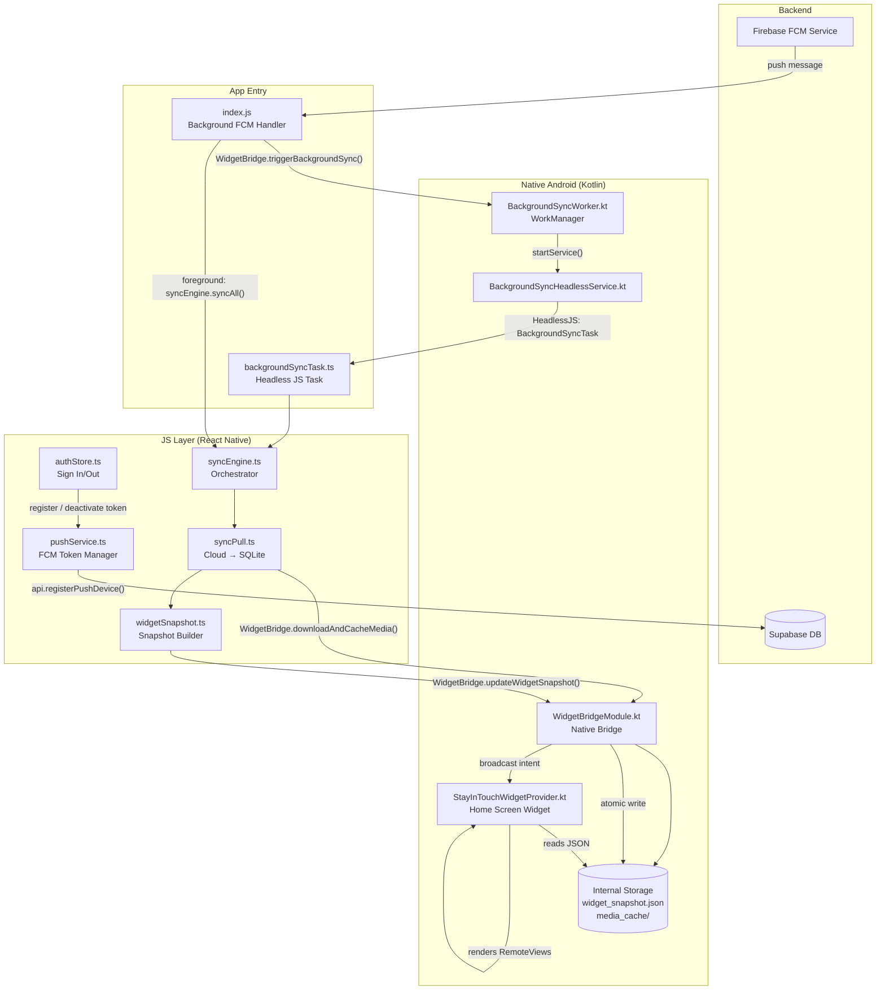

# FCM & Widget System — Deep Dive

## Architecture Overview

The SIT app uses Firebase Cloud Messaging (FCM) as a **real-time wakeup signal** — not for displaying notifications, but as a trigger to run a data sync. The Android home screen widget then reads that freshly synced data from a local file and renders it. There are two entirely separate data paths working in parallel.



---

## Part 1 — FCM (Push Notifications)

### 1.1 Token Registration — [`pushService.ts`](file:///d:/SIT/src/features/notifications/pushService.ts)

The `PushService` class is a singleton. Its lifecycle is tied to the auth state.

**On Sign-in** ([`authStore.ts:83`](file:///d:/SIT/src/features/auth/authStore.ts#L83-L87)):
```typescript
pushService.registerCurrentDeviceToken(userId).catch(...);
```
This is called **fire-and-forget** (non-blocking) so it never delays app startup or navigation.

**Inside `registerCurrentDeviceToken()`**, three things happen in sequence:
1. **Permission** — Requests `POST_NOTIFICATIONS` on Android 13+ (SDK ≥ 33), then calls `messaging().requestPermission()` for Firebase.
2. **Token** — Calls `messaging().getToken()` to get the device's unique FCM registration token. The token is stored in `this.activeToken` for later deactivation.
3. **Register with Backend** — Calls `api.registerPushDevice(token, platform)` which hits the Supabase RPC `register_push_device`. This writes the token into the `push_devices` table in the database, linking it to the authenticated user.

Then two **persistent listeners** are set up (each only once, guarded by null checks):
- `setupTokenRefreshListener()` — Listens for FCM token rotation. When Firebase rotates the token, it automatically re-registers the new token with the backend.
- `setupForegroundMessageHandler()` — Listens for incoming FCM messages **while the app is in the foreground**.

**On Sign-out** ([`authStore.ts:303`](file:///d:/SIT/src/features/auth/authStore.ts#L300-L308)):
```typescript
await pushService.deactivateCurrentDeviceToken();
```
This tears down both listeners, then calls `api.deactivatePushDevice(token)` which hits the Supabase RPC `deactivate_push_device` — marking the device token as inactive so the backend stops sending pushes to this device.

---

### 1.2 FCM Payload Validation — [`pushService.ts:20`](file:///d:/SIT/src/features/notifications/pushService.ts#L20-L29)

All FCM messages in SIT are **data-only messages** (no notification body). The payload is validated with `validateSITPayload()`:

```typescript
// Expected FCM data payload shape:
{ type: string, groupId?: string, reason?: string }
```

A message is only acted upon if it has a `type` field. This prevents random or malformed pushes from triggering a sync.

---

### 1.3 Message Handling — Three App States

FCM messages are handled differently depending on app state:

| App State | Handler | Location | What happens |
|---|---|---|---|
| **Foreground** | `messaging().onMessage()` | [`pushService.ts:191`](file:///d:/SIT/src/features/notifications/pushService.ts#L184-L210) | Directly calls `syncEngine.syncAll()` |
| **Background / Killed** | `messaging().setBackgroundMessageHandler()` | [`index.js:13`](file:///d:/SIT/index.js#L13-L33) | Calls `WidgetBridge.triggerBackgroundSync()` → WorkManager |

**Why different paths?**
- Foreground: the JS runtime is alive, so you can call `syncEngine.syncAll()` directly.
- Background/Killed: the JS runtime may not be running. You can't directly run JS. Instead you call the native `triggerBackgroundSync` bridge method which enqueues a **WorkManager** one-time job.

---

## Part 2 — Background Sync Engine

### 2.1 WorkManager + Headless JS Pipeline

When a background FCM arrives:

```
index.js (setBackgroundMessageHandler)
  → WidgetBridge.triggerBackgroundSync()           [JS → Native]
    → BackgroundSyncWorker.enqueueOneTimeWork()    [Kotlin, WorkManager]
      → BackgroundSyncHeadlessService.startService()  [Kotlin]
        → HeadlessJsTaskConfig("BackgroundSyncTask")  [Headless JS wakeup]
          → backgroundSyncTask.ts                 [JS, runs syncEngine.syncAll()]
```

**[`BackgroundSyncWorker.kt`](file:///d:/SIT/android/app/src/main/java/com/sit/BackgroundSyncWorker.kt)** — A `CoroutineWorker` that:
- Requires `NetworkType.CONNECTED` constraint (won't run offline)
- Uses `ExistingWorkPolicy.KEEP` so duplicate jobs are dropped, not stacked
- Also schedules **periodic work every 15 minutes** as a fallback heartbeat (registered once when the widget is first enabled)

**[`BackgroundSyncHeadlessService.kt`](file:///d:/SIT/android/app/src/main/java/com/sit/BackgroundSyncHeadlessService.kt)** — A `HeadlessJsTaskService` that wakes up the React Native JS runtime in the background with a 15-second timeout, triggering the `BackgroundSyncTask` Headless JS task.

**[`backgroundSyncTask.ts`](file:///d:/SIT/src/features/sync/backgroundSyncTask.ts)** — A simple async function registered as a Headless JS task in `index.js`. It calls `syncEngine.syncAll()` and returns.

---

### 2.2 Sync Engine — [`syncEngine.ts`](file:///d:/SIT/src/features/sync/syncEngine.ts)

The sync engine is the central orchestrator. It has a **concurrency lock** (`activeSyncPromise`) — if a sync is already running, new callers just await the existing promise rather than starting a second one.

`syncAll()` does:
1. Validates the active Supabase session
2. Gets the user's `groupId`
3. **Push** — `syncPush.processPendingQueue()` — uploads any local pending operations
4. **Pull** — `syncPull.pullRemoteChanges(groupId)` — downloads everything from cloud
5. Notifies all sync listeners on success

---

### 2.3 Sync Pull + Widget Update — [`syncPull.ts`](file:///d:/SIT/src/features/sync/syncPull.ts)

`pullRemoteChanges()` is the core data reconciliation step:

1. Fetches `groups`, `members`, `presences`, and `images` from Supabase
2. **Media Download Pipeline** — For each image, checks if it already exists locally via `WidgetBridge.getLocalMediaFile()`. If not, generates a signed URL from Supabase Storage and calls `WidgetBridge.downloadAndCacheMedia()` to save it to internal storage under `media_cache/`
3. Runs a single **atomic SQLite batch** (UPSERT groups, images, members, presences + DELETE removed members/presences + update sync cursor)
4. At the very end: **`widgetSnapshotService.updateAndNotifyWidget()`**

---

## Part 3 — Widget

### 3.1 Widget Snapshot — [`widgetSnapshot.ts`](file:///d:/SIT/src/features/widget/widgetSnapshot.ts)

Called after every successful sync pull (and also directly after a user checks-in from [`CheckInScreen.tsx`](file:///d:/SIT/src/features/presence/CheckInScreen.tsx) and [`HomeScreen.tsx`](file:///d:/SIT/src/features/presence/HomeScreen.tsx)).

`updateAndNotifyWidget()`:
1. Reads all group presences from local SQLite via `PresenceRepository.getAllGroupPresences()`
2. Builds a `WidgetSnapshotData` JSON object with all members' names, descriptions, and local file paths
3. Serializes it to JSON string
4. Calls `WidgetBridge.updateWidgetSnapshot(jsonString)` on the native side

### 3.2 Native Bridge — [`WidgetBridgeModule.kt`](file:///d:/SIT/android/app/src/main/java/com/sit/WidgetBridgeModule.kt)

Exposed as `NativeModules.WidgetBridge`. Key methods:

| Method | What it does |
|---|---|
| `updateWidgetSnapshot(json)` | Atomically writes `widget_snapshot.json` to internal files dir, then broadcasts `com.sit.ACTION_WIDGET_UPDATE` |
| `downloadAndCacheMedia(path, url)` | Downloads image from signed URL to `media_cache/media_img_<hash>.jpg` using atomic write (.tmp → rename) |
| `getLocalMediaFile(path)` | 100% offline check — returns local file path if cached, or null |
| `cropAndResizeImage(...)` | Crops + scales a local image using Bitmap API, saves to `media_cache/` |
| `triggerBackgroundSync()` | Calls `BackgroundSyncWorker.enqueueOneTimeWork()` |
| `notifyWidgetUpdate()` | Broadcasts `com.sit.ACTION_WIDGET_UPDATE` intent |

The **atomic write** pattern is critical: JSON is written to `.tmp` first, then renamed/moved atomically. This prevents the widget from ever reading a half-written file.

### 3.3 Android Widget Provider — [`StayInTouchWidgetProvider.kt`](file:///d:/SIT/android/app/src/main/java/com/sit/StayInTouchWidgetProvider.kt)

An `AppWidgetProvider` (BroadcastReceiver) that:

**On broadcast received** (from `WidgetBridgeModule.notifyWidgetUpdate()`):
- Reads `widget_snapshot.json` from internal storage
- Reads the current page index from `SharedPreferences` (`widget_prefs → current_index`)
- Picks the member at `index % count` to display
- Loads the local image file using `loadBitmap()` with sample size optimization
- Creates a **circular avatar** via `getCircularBitmap()` using a BitmapShader
- Renders an **adaptive presence image** via `renderAdaptivePresenceBitmap()` — calculates available pixel space accounting for widget dimensions, preserves aspect ratio
- Builds `RemoteViews` and calls `appWidgetManager.updateAppWidget()`

**On tap** (user taps the widget):
- Broadcasts `com.sit.ACTION_WIDGET_NEXT`
- Increments `current_index` in SharedPreferences
- Calls `updateAllWidgets()` → renders the next member's presence

**On widget enabled** (`onEnabled`):
- Registers the **15-minute periodic WorkManager** job as a background heartbeat

**Widget Rendering is done on a background thread** (`Executors.newSingleThreadExecutor()`) to avoid blocking the main thread.

**Media cleanup**: After each render, `cleanupObsoleteMedia()` deletes any cached `.jpg` files in `widget_media/` that are no longer referenced by the current snapshot.

---

### 3.4 `WidgetGuideCard.tsx` — [`WidgetGuideCard.tsx`](file:///d:/SIT/src/components/widget/WidgetGuideCard.tsx)

A simple UI card shown inside the app that guides the user to add the widget to their home screen. It's purely informational — lists 5 steps with numbered badges. No logic.

---

## End-to-End Flow Summary

### Flow A — Foreground FCM Message
```
FCM push arrives → pushService.onMessage() → validateSITPayload()
→ syncEngine.syncAll()
  → syncPull.pullRemoteChanges()
    → download new media to media_cache/
    → atomic SQLite batch upsert
    → widgetSnapshotService.updateAndNotifyWidget()
      → PresenceRepository.getAllGroupPresences()
      → WidgetBridge.updateWidgetSnapshot(json)
        → write widget_snapshot.json atomically
        → broadcast ACTION_WIDGET_UPDATE
          → StayInTouchWidgetProvider.updateAppWidget()
            → read snapshot.json
            → render RemoteViews with images
            → push to home screen
```

### Flow B — Background/Killed FCM Message
```
FCM push arrives → index.js setBackgroundMessageHandler()
→ WidgetBridge.triggerBackgroundSync()
  → BackgroundSyncWorker (WorkManager, CONNECTED constraint)
    → BackgroundSyncHeadlessService (HeadlessJS, 15s timeout)
      → backgroundSyncTask.ts → syncEngine.syncAll()
        → [same as Flow A from syncPull onwards]
```

### Flow C — User Posts a Check-in
```
CheckInScreen / HomeScreen → (local SQLite write)
→ widgetSnapshotService.updateAndNotifyWidget()
  → [same as widget update path above]
```

### Flow D — Widget Fallback Heartbeat
```
Every 15 minutes (WorkManager periodic job, active while widget is on home screen)
→ [same as Flow B from BackgroundSyncWorker onwards]
```
